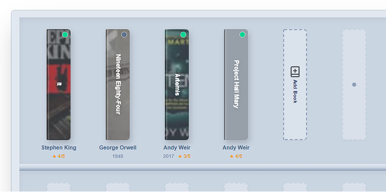
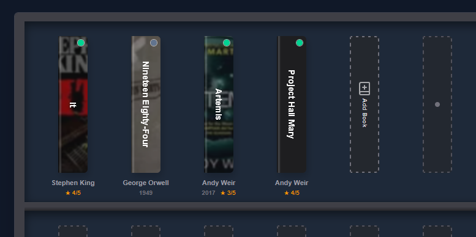
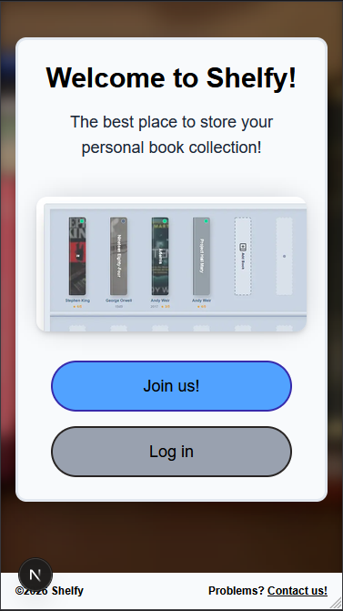
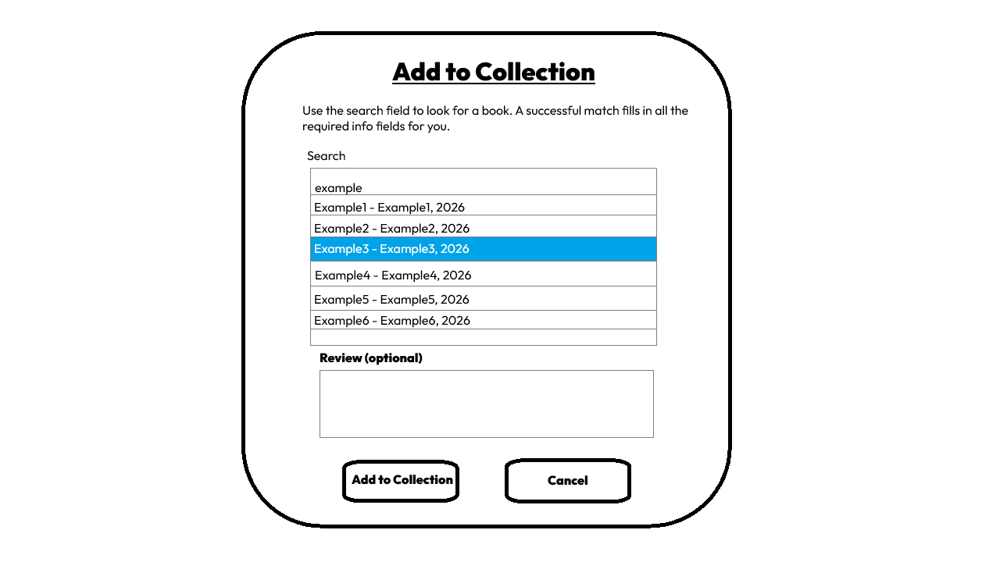
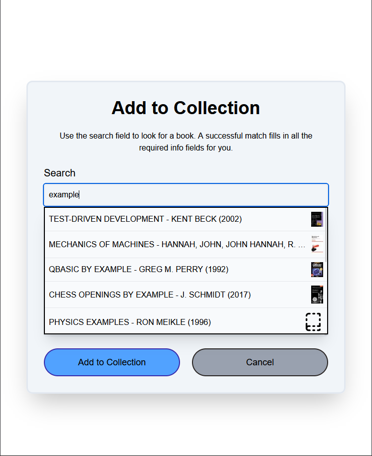

# Shelfy - Portfolio Project

> 🚧 Work in progress — see Known issues below for current state of the page.

---

## TL;DR
A searchable personal bookshelf built with Next.js, Tailwind CSS, and Supabase.

## Description
As my personal portfolio project for my front‑end development studies, I've created an application that lets the user search, add, and sort books in a digital bookcase. This app is a spiritual successor to my previous [Physical Collections](https://github.com/leo98lxl/physical-collections) project, where the same idea applies here: an app for collectors to visualize and keep track of their personal collections. Only this time, it's a functional application!

## Features
This application does the following:
- **Home page** – Choose *"Join us!"* to sign up or *"Log in"* for existing users.
- **Sign up** – Create an account (username optional). A confirmation email from Supabase Auth is sent; confirming redirects back to Home.
- **Log in** – Access *Your Shelfy* after authentication.
- **Your Shelfy** – View your personal bookshelf, add items, and sort by author, title, read/unread, etc. Log out returns you to Home.
- **Add Item** – Search for a book using Open Library's Search API, auto‑fill title/author/year, optionally set *read*, *rating* (5‑star), and *review*. Hover a book to see user reviews.
- **Footer** – "Contact us!" link opens a mailto: link to the author of this project.

## Screenshots
| Light mode | Dark mode |
|------------|-----------|
|  |  |

## Design comparison
| Sketch (wireframe) | Final implementation |
|--------------------|----------------------|
|  |  |
|  |  |

I know, I suck at drawing.

## Technologies
**Frontend**
- HTML
- CSS (Tailwind CSS)
- TypeScript
- Next.js
- React
- Lucide icons (https://lucide.dev/)

**Backend / Services**
- Supabase - Auth & database
- Open Library Search API - book search and metadata (https://openlibrary.org/dev/docs/api/search)
- AI agents (Claude for planning, Copilot, Antigravity for vibe coding, bug fixes, and code reviews)

## Requirements
- **Node.js** ≥ 18 (LTS) – install from https://nodejs.org
- npm (bundled with Node)

## Installation
### Prerequisites
1. Ensure Node.js (≥ 18) and npm are installed.
2. Create a Supabase project (free tier works). Retrieve the **URL** and **anon public API key** from *Project Settings → API*.

### Supabase configuration
```bash
cp .env.example .env.local   # copy template
# Edit .env.local and set:
# NEXT_PUBLIC_SUPABASE_URL=your-supabase-url
# NEXT_PUBLIC_SUPABASE_ANON_KEY=your-anon-key
```

### Local development
```bash
# Clone the repository
git clone https://github.com/leo98lxl/portfolio-leolek.git
cd portfolio-leolek

# Install exact dependencies
npm ci

# Start the dev server
npm run dev
```
Open <http://localhost:3000> in your browser.

### Optional deployment (production)
You can deploy the app to any Node‑compatible host (e.g., Vercel, Netlify, Railway, or Docker). For a quick Vercel deployment:
```bash
npm install -g vercel
vercel   # follow the prompts, select “React” as the framework
```
> **Note:** The deployed version also needs the Supabase environment variables (`NEXT_PUBLIC_SUPABASE_URL`, `NEXT_PUBLIC_SUPABASE_ANON_KEY`). Add them in the platform’s UI.

## Known issues (as of September 2026)
- 🔧 No reset button for the shelf sorting controls; use *"Add Item"* → *"Cancel"* to reset.
- 📱 Account creation works only on a computer; email confirmation on mobile devices is not functional yet.
- 📚 Only books are supported. Future versions may include movies, music, etc.

## What I've learned
- Creating a Next.js application without instructor guidance, leveraging AI throughout the process.
- Using Tailwind CSS for styling and handling light/dark modes.
- Integrating Supabase for authentication and persistent shelf data.
- Turning the development workflow into an MVP checklist to track feature progress.

---

## Author
Created by Leo Leksell.
- [GitHub](https://github.com/leo98lxl)
- [LinkedIn](https://www.linkedin.com/in/leo-leksell-443a50269/)
